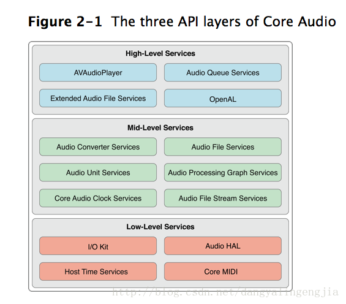

## 图示

## 步骤

1. 读取MP3文件

	> * Audio File Services：读写音频数据
	
2. 解析采样率、码率、时长等信息，分离MP3中的音频帧

	> * Audio File Stream Services：对音频进行解码(本地和网络)
	
3. 对分离出来的音频帧解码得到PCM数据

	> * Audio Converter services：音频数据转换
	
4. 对PCM数据进行音效处理（均衡器、混响器等，非必须）

	> * Audio Processing Graph Services：音效处理模块
	
5. 把PCM数据解码成音频信号

	> * Audio Unit Services：播放音频数据
	
6. 把音频信号交给硬件播放

	> * Audio Unit Services：播放音频数据
	
7. 重复1-6步直到播放完成

#### 其它

1. Extended Audio File Services：Audio File Services和Audio Converter services的结合体。
2. AVAudioPlayer/AVPlayer(AVFoundation)：高级接口，可以完成整个音频播放的过程（包括本地文件和网络流播放），除了音效处理功能。
3. Audio Queue Services：高级接口，可以进行录音和播放，可以完成播放流程中的3，5，6步骤。
4. OpenAL：用于游戏音频播放

## 参考

http://msching.github.io/blog/2014/07/07/audio-in-ios/

